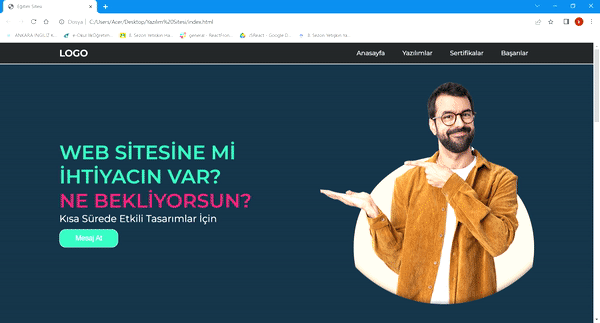

<h1> Yazılım Sitesi </h1>

Projemde bir yazılım şirketine ait web sitesi tasarımı yaptım.
projemde şirketin kullandığı yazılım dillerine, sahip olduğu sertifikalara yer verdim.
Navbar alanlarına tıklanınca direkt bağlantı kurulacak şekilde tasarım yaptım.
Tüm projeyi iconlar ve görseller ile zenginleştirdim.

<h1> Kullandığım Teknolojiler </h1>
HTML5 ve CSS3 ile tasarladım.

<h2> Ekran Görüntüsü </h2>
